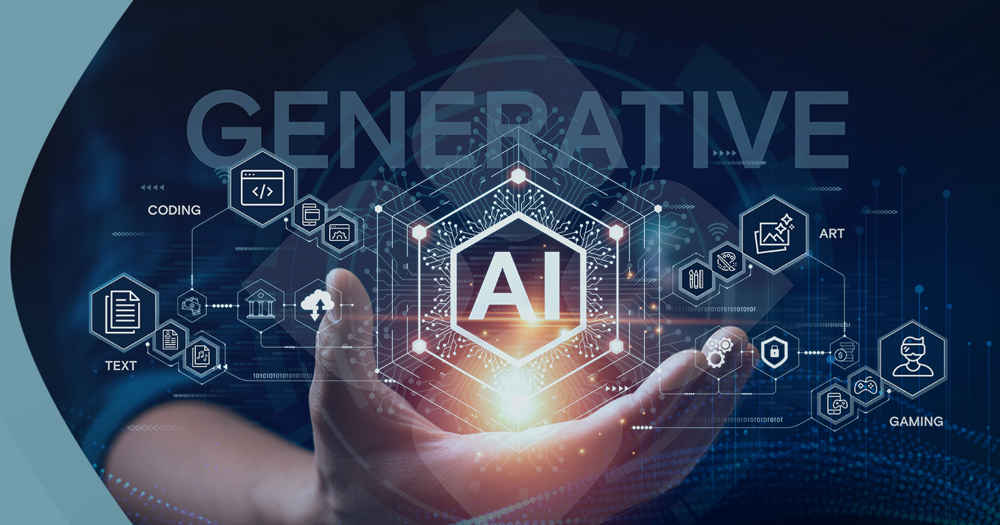

# Generative AI: The Future of Technology

What if a robot could draw a flying cat, write a pirate adventure, or invent a new game just for you? That’s **generative AI**, and it’s turning our wildest dreams into reality! This super-smart tech is like a magic wand for creating new things, and it’s about to make the future super exciting!

## What is Generative AI? (Explain Like I’m 5)

Generative AI is like a magical art box! Tell it, “Draw a sparkly dragon!” or “Make a song about ice cream!” and it creates something totally new. It learns from tons of pictures, stories, and songs to make stuff that feels real—like a friend who’s awesome at drawing, writing, or singing. For example, an AI once made a picture of a dog surfing on a rainbow! Cool, right?

## Why It’s So Awesome

Generative AI can do tons of fun things:

- **Draw Pictures**: It creates superheroes or glittery unicorns for your wall.
- **Help Doctors**: It invents new medicines to make sick people feel better.
- **Make Games**: It builds video game worlds, like a jungle full of talking monkeys.
- **Tell Stories**: It writes bedtime tales about you as a space explorer.
- **Teach Kids**: It makes lessons feel like a treasure hunt game.

## What’s Next?

Soon, generative AI will be even wilder! Imagine stepping into a movie it creates, like a pirate ship you can explore. It might live in your toys, helping you draw a talking teddy bear or learn math with fun puzzles. It’ll be everywhere, making life a big adventure!

## Things to Watch Out For

Sometimes, AI draws silly things or makes mistakes. We need to teach it to be fair and kind, like a good friend. Also, it uses lots of energy, so we must help the planet by using it wisely.

## What Makes Generative AI Special?

Generative AI is tech that creates new stuff—like text, images, or music—by learning from huge piles of data. Unlike regular AI that just analyzes, this AI acts like a creative artist. It uses tools like language models (e.g., [Grok 3](https://grok.com)) and image generators (e.g., [Stable Diffusion](https://stability.ai/stable-diffusion)) to make things like a poem or a sci-fi movie poster. For example, an AI once designed a sneaker ad that went viral!

## Why It’s Changing the World

This tech is shaking up everything:

- **Art & Music**: Tools like [Midjourney](https://www.midjourney.com) create paintings or songs in seconds, helping artists shine.
- **Healthcare**: AI designs new drugs, like one that fights tough diseases.
- **Coding**: It writes apps, making work faster for programmers.
- **Business**: It crafts ads that feel personal, like they’re made just for you.
- **Education**: It builds virtual classrooms that adapt to every student.

## The Future Is Wild

New AI models will mix text, images, and sound for mind-blowing experiences—like a virtual reality game that feels real. Soon, your phone or watch could run AI, creating on the go. Energy-saving tech will make it eco-friendlier too.

## Challenges to Fix

AI can mess up, like making fake videos or unfair pictures. We need rules to stop misuse and fair data to avoid mistakes. Plus, training AI uses tons of power, so greener methods are a must.

## A World of Creativity

Thanks for taking the time to explore the magic of Generative AI with me! Let’s keep the conversation going—connect with me on Medium, share your thoughts in the comments, or follow me on my socials for more tech adventures!

- 🐙 [GitHub: AreebaxIrfan](https://github.com/AreebaxIrfan)  
- 💼 [LinkedIn: Areeba Irfan](https://www.linkedin.com/in/areebairfan/)  
- 🐦 [Twitter/X: @areebaXirfan](https://x.com/areebaXirfan)

---

### Image

*Caption*: A robot artist creates magical worlds with Generative AI!

---

### Topics (Tags)

- Generative AI
- AI for Kids
- Creative Technology
- Future of AI
- AI Challenges
